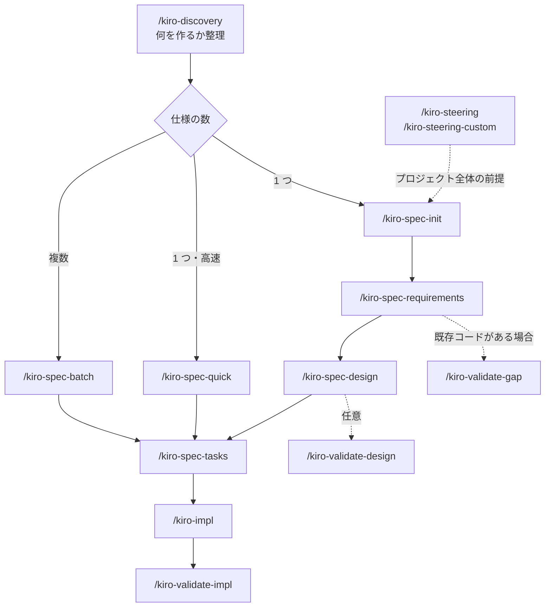

# cc-sdd スキル日本語版

`.claude/skills/` にある cc-sdd v3.0.2 のスキル（17 個・33 ファイル）を日本語に訳した参照用ドキュメント。

- Claude Code が実際に読み込むのは `.claude/skills/` の英語版であり、このディレクトリは読み込まれない。
- 各ファイルは原文と同じ相対パスに置いてある（例: `.claude/skills/kiro-impl/SKILL.md` → `docs/jp/skills/kiro-impl/SKILL.md`）。
- 出力フォーマットのフィールド名（`STATUS`、`VERDICT` など）やパス・コマンドは、実際の動作に合わせて英語のまま残している。
- スキルをカスタマイズしたときは、対応する日本語版も合わせて更新する。

## ワークフローの流れ

各フェーズ（要件 → 設計 → タスク）の間で人間の承認を挟むのが基本。`-y` を付けると承認を省略する。

## スキル一覧

「自動起動」が「しない」のスキルは `disable-model-invocation: true` が設定されており、ユーザーが `/` で明示的に呼んだときだけ動く。

### 準備・入口

| スキル | 役割 | 引数 | 自動起動 |
|---|---|---|---|
| [kiro-discovery](skills/kiro-discovery/SKILL.md) | 新しい作業の入口。既存仕様の更新・新規仕様・複数仕様への分解・仕様不要のどれにするかを対話で決める | `<idea-or-request>` | しない |
| [kiro-steering](skills/kiro-steering/SKILL.md) | `.kiro/steering/` をプロジェクトメモリとして作成・同期する | — | する |
| [kiro-steering-custom](skills/kiro-steering-custom/SKILL.md) | API 規約やテスト方針など、特定領域のステアリング文書を作る | — | する |

### 仕様作成

| スキル | 役割 | 引数 | 自動起動 |
|---|---|---|---|
| [kiro-spec-init](skills/kiro-spec-init/SKILL.md) | 説明文から新しい仕様を初期化する | `<project-description>` | する |
| [kiro-spec-requirements](skills/kiro-spec-requirements/SKILL.md) | EARS 形式で要件を生成する | — | する |
| [kiro-spec-design](skills/kiro-spec-design/SKILL.md) | 要件（WHAT）を技術設計（HOW）に落とし込む | `<feature-name> [-y]` | する |
| [kiro-spec-tasks](skills/kiro-spec-tasks/SKILL.md) | 要件と設計から実装タスクを生成する | `<feature-name> [-y] [--sequential]` | する |
| [kiro-spec-quick](skills/kiro-spec-quick/SKILL.md) | 初期化からタスクまでを一気に生成する高速ルート | `<project-description> [--auto]` | する |
| [kiro-spec-batch](skills/kiro-spec-batch/SKILL.md) | `roadmap.md` の全機能の仕様を、依存ウェーブごとに並列で作る | — | する |
| [kiro-spec-status](skills/kiro-spec-status/SKILL.md) | 仕様の状態と進捗を表示する | `<feature-name>` | する |

### 検証

| スキル | 役割 | 引数 | 自動起動 |
|---|---|---|---|
| [kiro-validate-gap](skills/kiro-validate-gap/SKILL.md) | 要件と既存コードベースのギャップを分析する | `<feature-name>` | する |
| [kiro-validate-design](skills/kiro-validate-design/SKILL.md) | 実装前に設計の品質を対話的にレビューする | `<feature-name>` | する |
| [kiro-validate-impl](skills/kiro-validate-impl/SKILL.md) | 全タスク完了後に、機能全体の統合を検証する（GO / NO-GO 判定） | `<feature-name> [task-numbers]` | する |

### 実装

| スキル | 役割 | 引数 | 自動起動 |
|---|---|---|---|
| [kiro-impl](skills/kiro-impl/SKILL.md) | 承認済みタスクを TDD で実装する。タスク番号なしなら自律モード、ありなら手動モード | `<feature-name> [task-numbers]` | しない |
| [kiro-review](skills/kiro-review/SKILL.md) | タスクの実装を仕様・境界・証拠に照らしてレビューする。主に `kiro-impl` のレビュー担当サブエージェントが使う | `<task-id>` | する |
| [kiro-debug](skills/kiro-debug/SKILL.md) | 根本原因を優先して実装の失敗を調査する。主に `kiro-impl` のデバッグ担当サブエージェントが使う | `<failure-summary>` | する |
| [kiro-verify-completion](skills/kiro-verify-completion/SKILL.md) | 「完了した」「テストが通った」と主張する前に、新しく取得した証拠で確認する | `<claim-type> <claim>` | する |

## 補助ファイル

スキル本体（`SKILL.md`）から参照されるルールやプロンプトのテンプレート。

| スキル | ファイル |
|---|---|
| kiro-impl | [templates/implementer-prompt.md](skills/kiro-impl/templates/implementer-prompt.md)、[templates/reviewer-prompt.md](skills/kiro-impl/templates/reviewer-prompt.md)、[templates/debugger-prompt.md](skills/kiro-impl/templates/debugger-prompt.md) |
| kiro-spec-requirements | [rules/ears-format.md](skills/kiro-spec-requirements/rules/ears-format.md)、[rules/requirements-review-gate.md](skills/kiro-spec-requirements/rules/requirements-review-gate.md) |
| kiro-spec-design | [rules/design-principles.md](skills/kiro-spec-design/rules/design-principles.md)、[rules/design-discovery-full.md](skills/kiro-spec-design/rules/design-discovery-full.md)、[rules/design-discovery-light.md](skills/kiro-spec-design/rules/design-discovery-light.md)、[rules/design-synthesis.md](skills/kiro-spec-design/rules/design-synthesis.md)、[rules/design-review-gate.md](skills/kiro-spec-design/rules/design-review-gate.md) |
| kiro-spec-tasks | [rules/tasks-generation.md](skills/kiro-spec-tasks/rules/tasks-generation.md)、[rules/tasks-parallel-analysis.md](skills/kiro-spec-tasks/rules/tasks-parallel-analysis.md) |
| kiro-validate-design | [rules/design-review.md](skills/kiro-validate-design/rules/design-review.md) |
| kiro-validate-gap | [rules/gap-analysis.md](skills/kiro-validate-gap/rules/gap-analysis.md) |
| kiro-steering | [rules/steering-principles.md](skills/kiro-steering/rules/steering-principles.md) |
| kiro-steering-custom | [rules/steering-principles.md](skills/kiro-steering-custom/rules/steering-principles.md) |

## 用語対訳

| 原文 | 訳語 |
|---|---|
| spec | 仕様 |
| steering | ステアリング |
| requirements / design / tasks | 要件 / 設計 / タスク |
| acceptance criteria | 受け入れ基準 |
| boundary | 境界 |
| approval / gate | 承認 / ゲート |
| subagent | サブエージェント |
| implementer / reviewer / debugger | 実装担当 / レビュー担当 / デバッグ担当 |
| remediation | 是正 |
| fresh evidence | 新しく取得した証拠 |
| root cause | 根本原因 |
| verdict | 判定 |
| dependency wave | 依存ウェーブ |
| validation / verification | 検証 / 確認 |
| brownfield / greenfield | 既存コードベース / 新規 |
