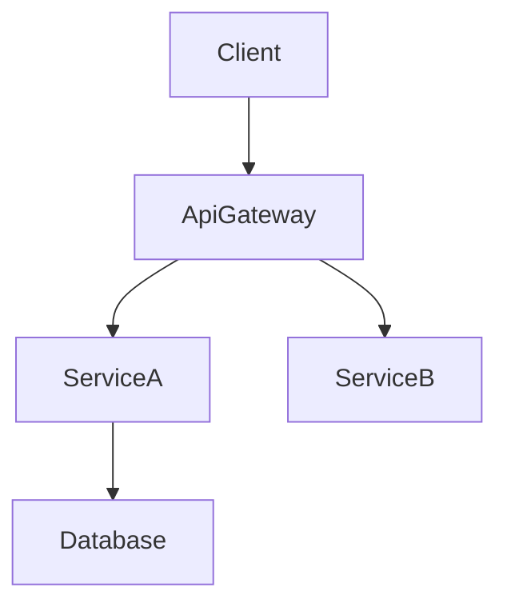

> 原文: `.claude/skills/kiro-spec-design/rules/design-principles.md`（cc-sdd v3.0.2）の日本語訳。参照用であり、Claude Code はこのファイルを読み込まない。

# 技術設計のルールと原則

## 中核となる設計原則

### 0. 境界優先
- **境界は必須、所有者は任意**
- コンポーネントを説明していても、責任の継ぎ目が曖昧なままの設計は、準備ができているとは言えない
- それがどう動くかを詳しく述べる前に、仕様が何を所有するかを定義する
- 何が境界外であるかを明示的に記録する
- 下流固有の振る舞いや前提を、上流の境界に漏れ込ませない

### 1. 型安全性は必須
- TypeScript のインターフェースで `any` 型を**決して**使わない
- すべての引数と戻り値に明示的な型を定義する
- エラー処理には判別共用体（discriminated union）を使う
- ジェネリクスの制約を明確に指定する

### 2. 設計と実装
- **HOW ではなく WHAT に焦点を当てる**
- コードではなく、インターフェースと契約を定義する
- 振る舞いは事前条件／事後条件によって規定する
- アルゴリズムではなく、アーキテクチャ上の決定を文書化する

### 3. 視覚的コミュニケーション
- **単純な機能**: 基本的なコンポーネント図、または図なし
- **中程度の複雑さ**: アーキテクチャ図 + データフロー図
- **高い複雑さ**: 複数の図（アーキテクチャ、シーケンス、状態）
- **常に純粋な Mermaid**: スタイル指定はせず、構造のみ

### 4. コンポーネント設計のルール
- **単一責任**: コンポーネントごとに明確な目的を 1 つ
- **明確な境界**: ドメインの所有を明示する
- **境界のコミットメントを先に**: コンポーネントを詳述する前に、この設計がコミットする責任の境界を述べる
- **依存の方向**: アーキテクチャのレイヤーに従う
- **インターフェース分離**: 最小限で焦点の絞られたインターフェース
- **チームにとって安全なインターフェース**: マージコンフリクトなしに並列実装できる境界を設計する
- **隠れた共同所有をなくす**: 2 つの領域が同じ振る舞いやデータを共同所有しているように見える場合、その設計は不完全である
- **調査のトレーサビリティ**: 境界に関する決定とその根拠を `research.md` に記録する

### 5. データモデリングの標準
- **ドメイン優先**: ビジネス上の概念から始める
- **整合性の境界**: 集約ルートを明確にする
- **正規化**: パフォーマンスと整合性のバランスをとる
- **進化**: スキーマの変更を見越して計画する

### 6. エラー処理の考え方
- **フェイルファスト**: 早い段階で明確に検証する
- **グレースフルデグラデーション**: 全面的な障害よりも部分的な機能提供を優先する
- **ユーザーの文脈**: 対処可能なエラーメッセージ
- **可観測性**: 包括的なロギングとモニタリング

### 7. 統合パターン
- **疎結合**: 依存関係を最小限にする
- **契約優先**: 実装の前にインターフェースを定義する
- **バージョニング**: API の進化を見越して計画する
- **冪等性**: リトライしても安全なように設計する
- **契約の可視性**: API とイベントの契約は design.md に明示し、拡張的な詳細は `research.md` からリンクする

### 8. 依存の方向
- design.md のアーキテクチャのセクションで、**依存の方向を定義し、強制する**（例: Types → Config → Repository → Service → Runtime → UI）
- 各レイヤーは、自分より左にあるレイヤーからのみインポートする。上方向へのインポートは決して行わない
- この制約は提案ではない。実装とレビューでは、違反をエラーとして扱うべきである
- File Structure Plan（ファイル構成計画）がファイルをコンポーネントに対応付ける際には、依存の方向によって、どのインポートが許可されるかが決まる

## ドキュメントの標準

### 言葉遣いと文体
- **宣言的**: "The system should authenticate"（システムは認証すべきである）ではなく "The system authenticates users"（システムはユーザーを認証する）
- **正確**: 曖昧な説明よりも具体的な技術用語
- **簡潔**: 本質的な情報のみ
- **フォーマル**: プロフェッショナルな技術文書

### 構造の要件
- **階層的**: 明確なセクション構成
- **トレース可能**: 要件からコンポーネントへの対応付け
- **完全**: 実装に必要なすべての側面を網羅する
- **一貫性**: 全体を通して統一された用語
- **焦点を絞る**: design.md はアーキテクチャと契約を中心に据え、調査ログや長い比較は `research.md` に移す

## セクション執筆のガイダンス

### 全体の順序
- デフォルトの流れ: Overview → Goals/Non-Goals → Boundary Commitments → Architecture → File Structure Plan → Components & Interfaces → 任意のセクション。
- 分かりやすくなる場合は、Traceability を前に移したり、Data Models を Architecture の近くに置いたりしてもよいが、セクション見出しはそのまま維持する。
- 各セクション内では **Summary → Scope → Decisions → Impacts/Risks**（要約 → スコープ → 決定 → 影響／リスク）の順に従い、レビュー担当が一貫して流し読みできるようにする。

### 要件 ID
- 要件は `2.1, 2.3` のように接頭辞なしで参照する（“Requirement 2.1” とはしない）。
- すべての要件は数値の ID を持たなければならない（MUST）。数値の ID を持たない要件がある場合は、停止し、続行する前に `requirements.md` を修正する。
- `N.M` 形式の数値 ID を使用する。ここで `N` は requirements.md におけるトップレベルの要件番号である（例: Requirement 1 → 1.1、1.2、Requirement 2 → 2.1、2.2）。
- すべてのコンポーネント、タスク、トレーサビリティの行は、同じ正規の数値 ID を参照しなければならない。

### 技術スタック
- この機能が影響するレイヤー（フロントエンド、バックエンド、データ、メッセージング、インフラ）のみを含める。
- レイヤーごとに、ツール／ライブラリ + バージョン + それが担う役割を明記する。拡張的な根拠、比較、ベンチマークは `research.md` に回す。
- 既存システムを拡張する場合は、現在のスタックからの逸脱を強調し、新しい依存関係を列挙する。

### システムフロー
- 図は、振る舞いを明確にする場合にのみ追加する:  
  - 複数ステップのやり取りには **Sequence**（シーケンス図）  
  - 分岐ルールやライフサイクルには **Process/State**（プロセス／状態図）  
  - パイプラインや非同期パターンには **Data/Event**（データ／イベント図）
- 常に純粋な Mermaid を使う。複雑なフローが存在しない場合は、セクション全体を省略する。

### 要件のトレーサビリティ
- 網羅性を示すために、標準の表（`Requirement | Summary | Components | Interfaces | Flows`）を使う。
- 1 つの要件が 1 つのコンポーネントに 1 対 1 で対応する場合にのみ、箇条書き形式に簡略化する。
- 単純な対応付けにはコンポーネントの要約表を優先し、完全なトレーサビリティ表は複雑な要件やコンプライアンス上センシティブな要件のためにとっておく。
- ずれを防ぐため、要件やコンポーネントが変わるたびにこの対応付けをやり直す。

### Components & Interfaces の執筆
- このセクションが始まる前に、Boundary Commitments によって所有の継ぎ目がすでに明示されているべきである。
- コンポーネントをドメイン／レイヤーごとにグループ化し、コンポーネントごとに 1 つのブロックを設ける。
- 冒頭に、Component、Domain、Intent、要件の網羅、主要な依存関係、選択した契約を列挙した要約表を置く。
- 表のフィールド: Intent（1 行）、Requirements（`2.1, 2.3`）、Owner/Reviewers（任意）。
- Dependencies の表では、各エントリを Inbound/Outbound/External のいずれかに分類し、Criticality（`P0` ブロッキング、`P1` 高リスク、`P2` 情報提供）を割り当てなければならない。
- 外部依存関係の調査の要約はここに置く。詳細な調査（API シグネチャ、レート制限、移行メモ）は `research.md` に属する。
- design.md は、それ単体で完結したレビュー用の成果物であり続けなければならない。`research.md` は背景としてのみ参照し、結論や決定はすべてここに改めて記載する。
- Contracts: 該当する種類（Service/API/Event/Batch/State）にのみチェックを付ける。チェックを付けていない種類は、後続のコンポーネントのセクションに登場させてはならない。
- Service インターフェースは、メソッドシグネチャ、入出力、エラーエンベロープを宣言しなければならない。API/Event/Batch の契約には、トリガー、ペイロード、配信、冪等性を網羅するスキーマ表または箇条書きが必要である。
- ロールアウト戦略、可観測性、未解決の決定を文書化するには、**Integration & Migration Notes**、**Validation Hooks**、**Open Questions / Risks** を使う。
- 詳細度のルール:
  - **完全なブロック**: 新しい境界を導入するコンポーネント（ロジックフック、共有サービス、外部統合、データレイヤー）。
  - **要約のみ**: 新しい境界を持たない表示用／UI コンポーネント（必要に応じて短い Implementation Note を添える）。
- 重複を減らすため、Implementation Notes では Integration / Validation / Risks を 1 つの箇条書きのサブセクションにまとめなければならない。
- 短いデータ（依存関係、契約の選択）にはリストやインラインの記述子を優先する。表は複数の項目を比較する場合にのみ使う。

### 共有インターフェースと Props
- 繰り返し現れる UI コンポーネントには基底インターフェース（例: `BaseUIPanelProps`）を定義し、コンポーネントごとにそれを拡張して差分のみを記述する。
- 新しい契約を導入するフック、ユーティリティ、統合アダプターには、それでも完全な TypeScript のシグネチャを含める。
- 基底の契約を再利用する場合は、コードブロックを複製するのではなく、明示的に参照する（例: “Extends `BaseUIPanelProps` with `onSubmitAnswer` callback”（`BaseUIPanelProps` を `onSubmitAnswer` コールバックで拡張する））。

### データモデル
- Domain Model は、集約、エンティティ、値オブジェクト、ドメインイベント、不変条件を扱う。Mermaid の図は、関係が自明でない場合にのみ追加する。
- Logical Data Model では、その変更に関係する構造、インデックス、シャーディング、ストレージ固有の考慮事項（イベントストア、KV／ワイドカラム）を明確に述べるべきである。
- Data Contracts & Integration セクションでは、機能が境界をまたぐ場合に、API のペイロード、イベントのスキーマ、サービス間の同期パターンを文書化する。
- 長い型定義やベンダー固有のオプションオブジェクトは design.md 内の Supporting References セクションに置き、関連するセクションからリンクする。調査メモは `research.md` にとどめる。
- Supporting References の使用は任意である。本文に置くと読みやすさが損なわれる場合にのみ作成する。design.md が単体で成り立つよう、すべての決定は依然として本文のセクションに記載されていなければならない。

### Error/Testing/Security/Performance のセクション
- 機能固有の決定や逸脱のみを記録する。基本的なプラクティスについては、組織全体の標準（ステアリング）を再掲するのではなく、リンクまたは参照する。

### 図とテキストの重複排除
- 図の内容をそのまま文章で繰り返さない。テキストは、図からは自明でない主要な決定、トレードオフ、影響を強調するために使う。
- 決定が図の注釈で完全に表現されている場合は、短い “Key Decisions”（主要な決定）の箇条書きで十分である。

### 全般的な重複排除
- Overview、Architecture、Components の間で同じ情報を繰り返さない。文脈が同一の場合は前のセクションを参照する。
- 要件とコンポーネントの関係が要約表に記載されている場合は、追加のニュアンスがない限り、他の場所で書き直さない。

## 図のガイドライン

### 図を含めるべきとき
- **Architecture**: 3 つ以上のコンポーネントや外部システムがやり取りする場合は、構造図を使う。
- **Sequence**: 呼び出し／ハンドシェイクが複数ステップにわたる場合は、シーケンス図を描く。
- **State / Flow**: 複雑なステートマシンやビジネスフローは、専用の図に描き起こす。
- **ER**: 自明でないデータモデルには、実体関連図を用意する。
- **Skip**（省略）: 1 つのコンポーネントに閉じた小さな変更には、一般に図は不要である。

### Mermaid の要件

- **プレーンな Mermaid のみ** – カスタムのスタイル指定やサポートされていない構文は避ける。
- **ノード ID** – 英数字とアンダースコアのみ（例: `Client`、`ServiceA`）。`@`、`/`、先頭の `-` は使わない。
- **ラベル** – 簡単な単語にする。丸括弧 `()`、角括弧 `[]`、引用符 `"`、スラッシュ `/` を埋め込まない。
  - ❌ `DnD[@dnd-kit/core]` → 不正な ID（`@`）。
  - ❌ `UI[KanbanBoard(React)]` → 不正なラベル（`()`）。
  - ✅ `DndKit[dnd-kit core]` → ラベルにはプレーンなテキストを使い、技術的な詳細は添える説明文のほうに書く。
  - ℹ️ そうしないと、Mermaid の strict モードは `Expecting 'SQE' ... got 'PS'` のようなエラーで失敗する。レンダリングの前にラベルから記号を取り除くこと。
- **エッジ** – データまたは制御の流れの方向を示す。
- **グループ** – 関連するコンポーネントをまとめるために Mermaid の subgraph を使うことは許可されている。分かりやすさのために控えめに使う。

## 品質指標
### 設計の完全性チェックリスト
- すべての要件に対応している
- 実装の詳細が漏れ出していない
- コンポーネントの境界が明確である
- エラー処理が明示されている
- 包括的なテスト戦略がある
- セキュリティが考慮されている
- パフォーマンス目標が定義されている
- 移行パスが明確である（該当する場合）

### 避けるべき一般的なアンチパターン
❌ 設計と実装の混同
❌ 曖昧なインターフェース定義
❌ エラーシナリオの欠落
❌ 非機能要件の無視
❌ 過度に複雑なアーキテクチャ
❌ コンポーネント間の密結合
❌ データ整合性の戦略の欠落
❌ 不完全な依存関係の分析
